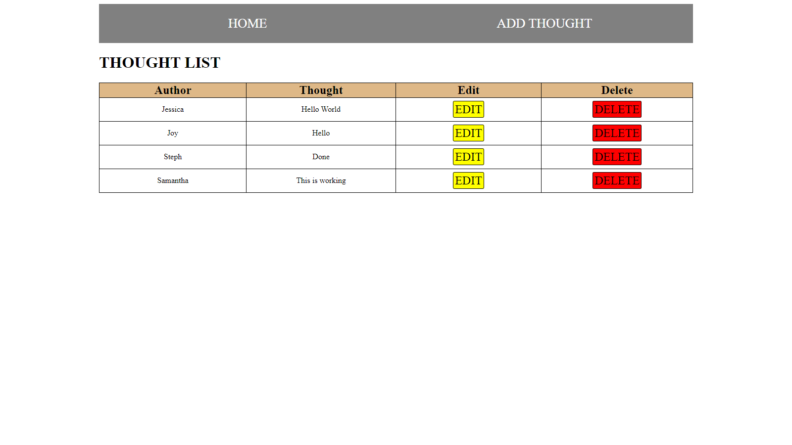

# PERN Thoughts

### A full-stack site using Postgres, Express.JS, React.JS and Node.JS


### Technologies used
* Client-side
    * React
    * React-Router-Dom
    * Axios
* Server-side
    * Bad-words
    * Concurrently
    * Cors
    * Dotenv
    * Express
    * Nodemon
    * Pg (PostgreSQL Database)

### Setup
* Clone GitHub repos
* Run code on main folder and client folder: 
```bash
npm install
```
* Add .env file to main folder and insert the following: 
```nodejs
DB_USER=""
DB_PASSWORD=""
DB_HOST=""
DB_PORT=""
DB_DATABASE=""
```
*Add own details in quotes*
* Run code on main folder: 
```bash
npm run dev
```